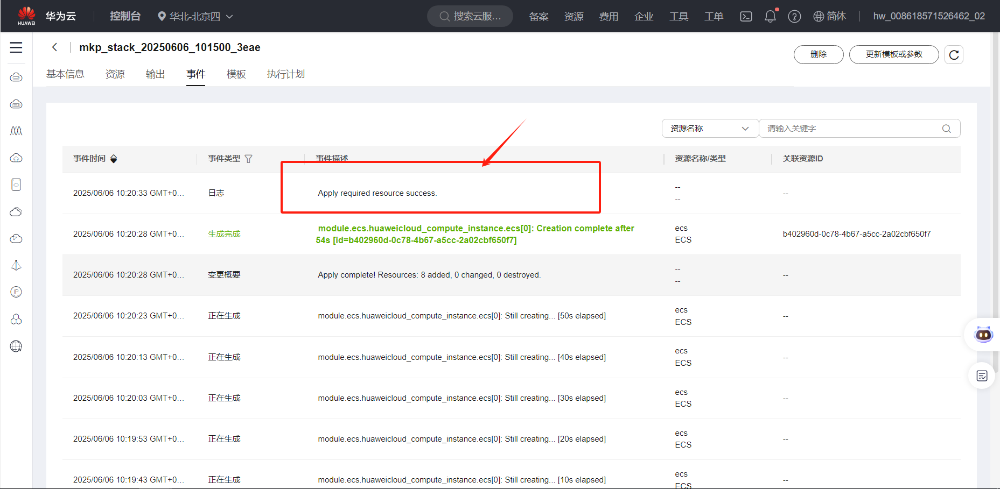
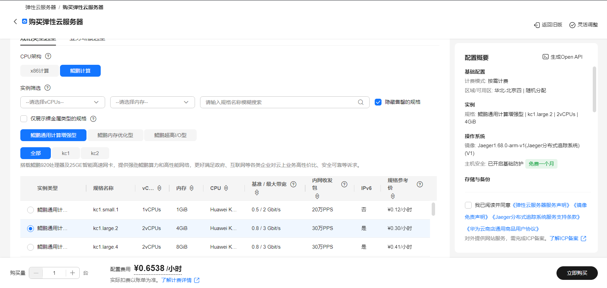
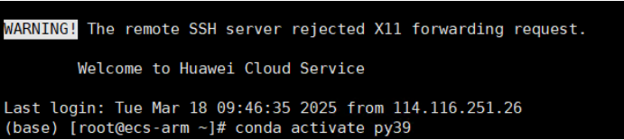
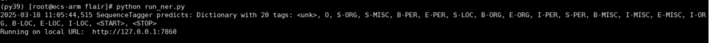

# flair自然语言处理工具使用指南

# 一、商品链接

[flair自然语言处理工具](https://marketplace.huaweicloud.com/hidden/contents/d603cf33-1c2d-4824-8082-c7b16d0045ac?ticket=ST-8498869-6tBmB3EjFGiJXaGfoTDKTQdD-sso#productid=OFFI1121281251575148544)

# 二、商品说明

**Flair** 是一个开源的自然语言处理（NLP）框架，旨在为研究人员提供用于各种文本分析任务的灵活高效的工具集。本商品基于arm架构的Huawei Cloud EulerOS 2.0 64bit系统，提供开箱即用的flair。

# 三、商品购买

您可以在云商店搜索 **flair自然语言处理工具**。

其中，地域、规格、推荐配置使用默认，购买方式根据您的需求选择按需/按月/按年，短期使用推荐按需，长期使用推荐按月/按年，确认配置后点击“立即购买”。


## 3.1 使用 RFS 模板直接部署

必填项填写后，点击 下一步


创建直接计划后，点击 确定


点击部署，执行计划

如下图“Apply required resource success. ”即为资源创建完成

# 3.2ECS 控制台配置

### 准备工作

在使用ECS控制台配置前，需要您提前配置好 **安全组规则**。

> **安全组规则的配置如下：**
> - 入方向规则放通端口7860，源地址内必须包含您的客户端ip，否则无法访问
> - 入方向规则放通 CloudShell 连接实例使用的端口 `22`，以便在控制台登录调试
> - 出方向规则一键放通

### 创建ECS

前提工作准备好后，选择 ECS 控制台配置跳转到[购买ECS](https://support.huaweicloud.com/qs-ecs/ecs_01_0103.html) 页面，ECS 资源的配置如下图所示：

选择CPU架构

选择服务器规格

选择镜像

其他参数根据实际请客进行填写，填写完成之后，点击立即购买即可


> **值得注意的是：**
> - VPC 您可以自行创建
> - 安全组选择 [**准备工作**](#准备工作) 中配置的安全组；
> - 弹性公网IP选择现在购买，推荐选择“按流量计费”，带宽大小可设置为5Mbit/s；
> - 高级配置需要在高级选项支持注入自定义数据，所以登录凭证不能选择“密码”，选择创建后设置；
> - 其余默认或按规则填写即可。

# 商品使用

## flai使用

### 激活环境
登录到服务器上运行以下命令，激活环境

```bash
conda activate py39
```



## 新建run_ner.py文件内容为
```python
 
import gradio as gr
from flair.data import Sentence
from flair.models import SequenceTagger
 
# 加载命名实体识别模型和情感分析模型
tagger = SequenceTagger.load("./models/en-ner-conll03-v0.4.pt")
 
 
def analyze_sentence(input_text):
    # 创建Sentence对象
    tagger_sentence = Sentence(input_text)
 
    # 使用命名实体识别模型进行预测
    tagger.predict(tagger_sentence)
 
    # 提取NER结果
    ner_result = "\n".join([str(label) for label in tagger_sentence.labels])
 
    return ner_result
 
 
# 创建Gradio界面
iface = gr.Interface(
    fn=analyze_sentence,
    inputs=gr.Textbox(label="Enter a sentence"),
    outputs=[
        gr.Textbox(label="Named Entities"),
    ],
    examples=[
        ["Our family took a trip to Washington DC and Hawaii this summer and it was a memorable one.",]
    ],
    title="Sentence Analysis with Flair",
    description="Input a sentence and see the named entities and sentiment analysis results."
)
 
# 启动Gradio应用
iface.launch()

```


### 使用 gradio 构建 Web 应用界面
编写Python函数来处理输入句子，并调用flair的实体提取。在界面中定义输入组件和输出组
件，以接收用户输入的句子并显示实体提取的结果。
启动Gradio应用，并在浏览器中访问其界面以进行测试。


```bash
cd /opt/flair
python run_ner.py
```




### 通过 URL 访问 WEB 页面
通过ip+7860端口即可访问到web页面


### 参考文档

[flair官网](https://github.com/flairNLP/flair)
